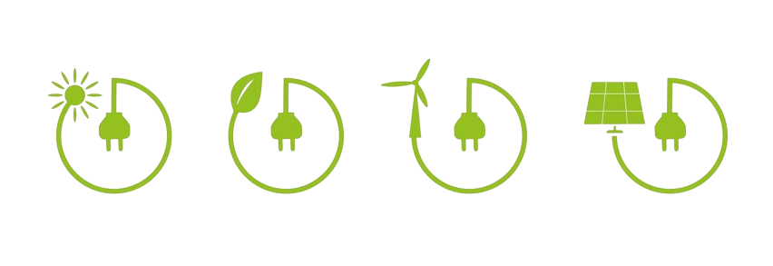

<br />
<div align="center">
     

<h2 align="center">Green Earth</h2>
<br/>

<p align="center">Green Earth is an application implemented to inform people about initiatives for a greener future as well as analyzing current and historical data of pollutants.</p>
<a href="https://mygreenearth.netlify.app/"><strong>View Demo</strong></a>
<br />
</div>
<br /><br />

<details>
  <summary>Table of Contents</summary>
  <ol>
    <li><a href="#built-with">Built With</a></li>
    <li><a href="#installation">Installation</a></li>
    <li><a href="#usage">Usage</a></li>
    <li><a href="#technical-choices">Technical Choices</a></li>
    <li><a href="#license">License</a></li>
    <li><a href="#contact">Contact</a></li>
  </ol>
</details>

## Built with

<ul style="list-style-type: none;">
<li>

</li>
<li>
  
</li>
<li>

<li>

</li>
</ul>

## Installation

1. Clone the repo
   ```sh
   git clone https://github.com/David92p/Green-Earth.git
   ```
2. Install NPM packages
   ```sh
   npm install
   ```
3. Add your access keys
   ```sh
   - Register on the WeatherAPI website and get your access key
   - Create the .env file in the root directory
   - Add an environment variable with this name and your private key
     VITE_APP_OPENWEATHER_KEY = "YOUR WeatherAPI KEY"
   - Register and obtain the keys to use the contact form from EmailJS (Not necessary for the complete functioning of the web page)
   - Add environment variables with this name and your private key
     VITE_APP_SERVICE_ID = "YOUR EMAILJS KEY SERVICE ID"
     VITE_APP_TEMPLATE_ID = "YOUR EMAILJS KEY TEMPLATE ID"
     VITE_APP_PUBLIC_KEY = "YOUR EMAILJS KEY PUBLIC KEY"
   ```
4. Run
   ```sh
   npm run dev
   ```
5. Press "o" or click the link in the terminal.

## Usage

<ul style="list-style-type: none;">
    <li>
      <h4>Introduction</h4>
      <div align="center">
        
      </div>
      <br />
      <ul>
        <li>Use the main button to analyze data for the main pollutants.</li>
        <li>A brief introduction and description of our work and objective.</li>
      </ul>
    </li>
    <br />
    <li>
      <h4>Analysis and Data</h4>
      <div align="center">
        
      </div>
      <br />
      <ul>
        <li>Research and analyze data, both present and historical, of the main cities.</li>
        <li>Our team works to keep the data continuously updated, we put information first.</li>
      </ul>
    </li>
    <br />
    <li>
      <h4>Projects and Initiatives</h4>
      <div align="center">
        
      </div>
      <br />
      <ul>
        <li>Explanation of the biggest project towards a greener future.</li>
        <li>Subdivision of the historical phases for achieving the EU objectives.</li>
      </ul>
    </li>
    <br />
    <li>
      <h4>Detailed explanation of pollutants.</h4>
      <div align="center">
        
      </div>
      <br />
      <ul>
        <li>Description of pollutants.</li>
        <li>Useful resources for an in-depth study of the substances.</li>
      </ul>
    </li>
    <li>
      <h4>Contact</h4>
      <div align="center">
        
      </div>
      <br />
      <ul>
        <li>This section is dedicated to users who wish to contact us for any information in this regard.</li>
        <li>Contacts from developers useful for development or for simple collaborations, even if not related to the same project, are always appreciated.</li>
      </ul>
    </li>
  </ul>
  
  ## Technical Choices
  
  
  <ul
    <li><h3>React</h3></li>
    <ul>
        <li>It was chosen for its practicality in integrating with the numerous libraries available and exploiting dynamic and engaging interfaces thanks to its component-based structure and virtual DOM.</li>
     </ul>
  </ul>
  <ul
    <li><h3>Typescript</h3></li>
    <ul>
        <li>Type checking in a project helped me find any code errors earlier and be able to fix them in less time than pure JS.</li>
     </ul>
  </ul>
    <ul
    <li><h3>TailwindCSS</h3></li>
    <ul>
        <li>Used to model the application smoothly and efficiently through the classes provided by the library.</li>
     </ul>
  </ul>
  <br>
  
  ## License

Distributed under the MIT License.

## Contact

Linkedin - [</img>](https://it.linkedin.com/in/davide-panetta-065420207)

GitHub - [</img>](https://github.com/David92p)

Project Link - [https://github.com/David92p/Green-Earth](https://github.com/David92p/Green-Earth)

Live Demo - [https://mygreenearth.netlify.app/](https://mygreenearth.netlify.app/)
